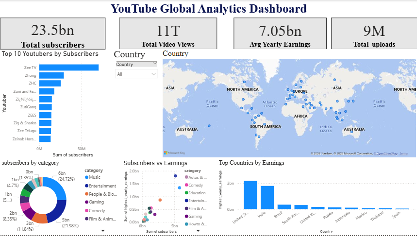

📊 YouTube Global Analytics Dashboard

This project presents a Power BI dashboard analyzing global YouTube data.

🔍 Key Insights

* Total Subscribers, Views, Earnings, and Uploads
* Top 10 YouTubers by Subscribers
* Country-wise YouTube distribution
* Category-wise performance
* Relationship between Subscribers and Earnings

📌 Tools Used

* Power BI
* Data Visualization
* Data Analysis

## 📷 Dashboard Preview

📁 Files

* youtube-dashboard.pbix
* dashboard.png
* Global Youtube Data
